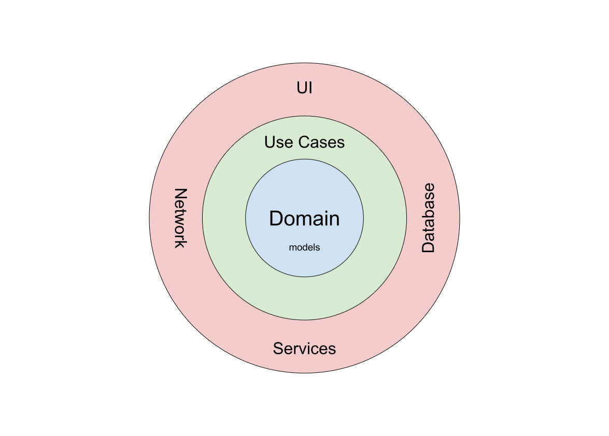
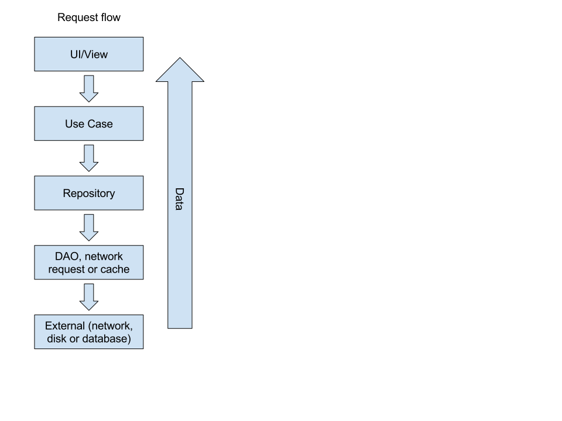

Hydra Android Architectural Guide (HAAG) or, since we like fancy abbreviations, HAAG™.

# Current status

This currently describes what we would want the architecture and design to be like. This is not yet
the case, and is an ongoing effort, see [HEE](project.md).

# Introduction

We use the Clean Architecture in our app. This guide is not a general explanation, but rather our
interpretation and implementation.

# Description of layers and packages

## Domain

The core of the app is the domain layer. This layer contains all things that are traditionally called the
_business logic_. This layer is completely isolated from the other parts of the app and does not have any
dependencies. At least in theory. Currently, there are some minor dependencies on Android-related code, like
the `SharedPreferences` (which is an interface).

In particular, our app's domain contains two things.

### Entities

The classes, as you would find them in a class diagram.

Normally, these classes do not have anything to do with the database, json or the Android framework. In cases
where the domain layer is almost empty, i.e. there is no logic, these classes might implement `Parcelable` 
and/or have annotation from Gson.

A good rule is as follows: if you have the modify the structure of the class (e.g. fields) to fit the json
definition (or other things), you should probably split the model into a domain model and a DTO (_data transfer object_).

### Use cases

These are literally what their name implies: they implement the equivalent of a use case. They might also be called
interactors.

Almost all to query data return a `LiveData`, which will automatically update if the data changes and load
the data on a background thread.

A use case often has a bunch of related interfaces to actually access the data. For example, a `GetAnnouncements`
use case (for Minerva) would have an accompanying interface `AnnouncementRepository`. A use case only has a 
reference to the interface, never to the implementations.

## DI (dependency injection)

As mentioned in the previous part, a use case only knows about the interface. However, it still needs an actual
implementation to function. This is where `Dagger2` comes in.

The `di` package contains the configurations to map the interfaces to their implementations in other packages.
For example, there might be a module that specifies the implementation for `AnnouncementRepository` should be
an instance of `DatabaseAnnouncementRepository`.

## Data

This contains all things necessary to retrieve and store data. This might be the database, classes to access
network API's and so on.

In Hydra, we have made the decision to consider caching part of the domain logic. This means the use cases decide
if data is cached or not. The caching logic (when to cache what) is also part of the domain. The actual implementation
(currently Java serialisation) is not. This is also part of the data package.

## Device

This contains things that do not fit in the data, such as implementations for threading, notifications and so on.
If you need a Android service, you will probably implement an interface in this package that uses that service.

This last thing might seem a lot of boiler plate for nothing: define an interface that just calls though for 
every service you need seems a lot of work. The reason we do this is simple: testing.

Sometimes it is not always clear where something belongs, e.g. one might argue that caching is better suited to
be in this package than in `data`. A good rule is: if it interacts or processes data, put it in `data`, otherwise it
goes in `device`.

## UI

These contain the classes for user-facing things. Here you will find the more traditional Android classes, such
as `Activity` and `Fragment`. Here you will also find all other classes necessary for the UI, such as
view models, `RecyclerView` adapters and so on.

## Utils

Helper functions used throughout the app.

# Architectural overview

The architectural intent can be captured nicely with some images. The architectural dependencies can be
viewed as an onion (thus the onion architecture), with different layers. A layer can only depend on the
layers below, never on those above.

The data flow often goes like this:

However, it is important to know that (not always but most of the time), the actual actions are done
by the `LiveData`. The UI (often in a `ViewModel`) requests a result from the `UseCase`. This will return
in a lazy `LiveData`, which means the data is not actually computed yet.

The UI then subscribes on that `LiveData`, which causes the data to be computed. Internally, the `LiveData`
will often use the `UseCase` to actually compute the data.

The `LiveData` then also monitors the data and listens for changes. These might be the preferences, or in the
case of Room, database changes.
